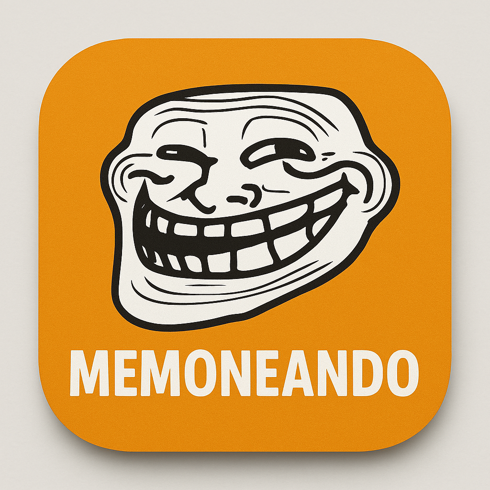

# Memoneando - Editor de Contenido Visual Avanzado



**Memoneando** es un editor de contenido visual gratuito y de código abierto, diseñado para crear memes, contenido para redes sociales y material gráfico de forma rápida e intuitiva. Desarrollado en C++ con Qt Framework.

## 🚀 Características principales

### 🎨 Edición avanzada de contenido visual
- **Sistema de capas profesional** con reordenamiento visual completo (drag & drop)
- **Selección múltiple de capas** con Ctrl+Click y Shift+Click para operaciones en lote
- **Modos de mezcla funcionales** (Normal, Multiplicar, Pantalla, Superposición, Luz suave, Luz fuerte)
- **Reordenamiento de capas** con botones ↑/↓ y drag & drop que refleja el Z-order en tiempo real
- **Nombres personalizables** para capas con doble clic para renombrar
- **Eliminación automática de fondo** por color con tolerancia ajustable y vista previa
- **Exportación con transparencia** (PNG) para conservar fondos eliminados
- **Soporte para texto** con fuentes personalizables y texto por defecto configurable
- **Cambio de color de texto** individual o múltiple desde menú contextual
- **Buscador de imágenes gratuitas** integrado con acceso a miles de imágenes libres de Pixabay
- **Importación de imágenes** en múltiples formatos (PNG, JPG, JPEG, BMP, GIF, TIFF)
- **Transformaciones** de capas (rotación, escala, posición)
- **Operaciones en lote** para modificar propiedades de múltiples capas simultáneamente
- **Canvas redimensionable** con tamaños preconfigurados para redes sociales
- **Color de fondo personalizable** del canvas que afecta la exportación
- **Edición de texto** con doble clic y modo teclado

### 🔍 Buscador de imágenes gratuitas integrado
- **Múltiples proveedores** de imágenes libres de derechos:
  - **Pixabay**: API gratuita sin restricciones, ideal para uso general
  - **Unsplash**: Fotografías profesionales de alta calidad (requiere API key)
  - **Pexels**: Imágenes y videos gratuitos de calidad (requiere API key)
  - **Wikimedia Commons**: Contenido de dominio público y Creative Commons
  - **Lorem Picsum**: Imágenes placeholder para desarrollo y pruebas
- **Selector de proveedor** en la interfaz para elegir la fuente de imágenes
- **Búsqueda inteligente** por términos en español e inglés
- **Vista previa en cuadrícula** con información detallada (dimensiones, vistas, descargas)
- **Descarga automática** e integración directa como nueva capa
- **Acceso múltiple** desde 4 ubicaciones diferentes:
  - **Panel de capas**: Botón "Web" (más visible y accesible)
  - **Barra de herramientas**: Botón "Web" 
  - **Menú contextual**: "Buscar imágenes web"
  - **Menú principal**: Herramientas → Buscar imágenes online
- **Filtros automáticos**: Contenido seguro, calidad mínima, tamaños optimizados
- **Información de proveedores**: Cada proveedor muestra sus características y requisitos
- **Funcionamiento**: Requiere conexión a internet, todas las demás funciones son offline

### 📱 Tamaños optimizados para redes sociales
- Instagram Post (1080x1080)
- Instagram Story (1080x1920)
- Facebook Post (1200x630)
- Twitter Post (1024x512)
- WhatsApp Status (1080x1920)
- Meme Clásico (800x600)
- Tamaño personalizado

### 🎛️ Interfaz intuitiva y accesible
- **Menú superior** completo con todas las opciones organizadas
- **Panel de capas avanzado** con reordenamiento visual drag & drop y botones ↑/↓
- **Panel de propiedades** para transformaciones precisas
- **Panel de configuración rápida** en lateral derecho con controles directos
- **Menú contextual** (clic derecho en canvas) para acceso rápido a funciones
- **Cambio de color de texto** desde menú contextual para capas de texto
- **Barra de herramientas** con iconos intuitivos y tooltips
- **Buscador de imágenes online** visible en:
  - **Botón "Web" en panel de capas** (más visible y accesible)
  - **Botón "Web" en barra de herramientas**
  - **Menú contextual**: "Buscar imágenes web"
  - **Menú principal**: Herramientas → Buscar imágenes online
- **Control de modos de mezcla** sincronizado entre panel de capas y propiedades
- **Eliminación de fondo avanzada** con selector de color interactivo en menú, barra de herramientas y menú contextual
- **Eliminación de capas** con tecla `Delete` y botón "Eliminar"
- **Zoom y navegación** fluidos del canvas
- **Bandeja del sistema** con icono personalizado

### ⚙️ Configuración completa
- Tema claro/oscuro
- Configuración de fuentes y colores por defecto desde múltiples ubicaciones
- **Color de fondo del canvas personalizable** desde panel lateral y menú contextual
- **Texto por defecto configurable** para nuevas capas desde panel lateral
- Guardado automático de configuraciones
- Opciones de exportación avanzadas
- Marca de agua opcional

### 💾 Exportación profesional
- Formatos de salida: PNG, JPEG, BMP, TIFF
- **Exportación con transparencia** (PNG) para imágenes con fondo eliminado
- Control de calidad JPEG
- Tamaños optimizados para compartir
- Marca de agua "Memoneando" opcional

### 🔗 Integración y soporte
- **Ventana "Acerca de" mejorada** con logo, descripción completa y diseño profesional
- **Botón "Ver en GitHub"** que abre el navegador web real (Firefox, Chrome, etc.)
- **Código abierto** y transparente para la comunidad
- **Acceso fácil** a documentación y contribuciones

### 🎨 Funciones avanzadas de edición
- **Eliminación automática de fondo por color** con:
  - Tolerancia ajustable (0-100)
  - Vista previa en tiempo real
  - Conservación de transparencia en exportación PNG
  - Integración completa en la interfaz
- **Sistema de capas mejorado** con:
  - Nombres automáticos únicos
  - Reordenamiento que refleja Z-order en canvas
  - Sincronización completa entre lista y renderizado
  - Nuevas capas siempre al frente

## 📦 Instalación

### Opción 1: Instalación desde paquete .deb (Ubuntu/Debian) - RECOMENDADO

**Descarga e instala el paquete .deb precompilado:**

```bash
# Descargar el paquete (o usar el archivo proporcionado)
# wget https://github.com/sapoclay/memoneando/releases/download/v1.0.1/memoneando_1.0.1_amd64.deb

# Instalar el paquete
sudo dpkg -i memoneando_1.0.4_amd64.deb

# Si hay dependencias faltantes, ejecutar:
sudo apt-get install -f
```

**Verificar instalación:**
```bash
# Comprobar que está instalado
dpkg -l | grep memoneando

# Ejecutar desde cualquier ubicación
memoneando

# O encontrarlo en el menú de aplicaciones → Gráficos → Memoneando
```

**Desinstalar:**
```bash
sudo dpkg -r memoneando
```

### Opción 2: Compilación desde código fuente

#### Dependencias (Ubuntu/Debian)
```bash
sudo apt update
sudo apt install build-essential cmake git
sudo apt install qt6-base-dev qt6-tools-dev qt6-tools-dev-tools
sudo apt install libqt6network6 libqt6network6-dev  # Para el buscador de imágenes
```

#### Dependencias (Fedora/RHEL)
```bash
sudo dnf install gcc-c++ cmake git
sudo dnf install qt6-qtbase-devel qt6-qttools-devel
sudo dnf install qt6-qtnetworkauth-devel  # Para el buscador de imágenes
```

#### Compilación
```bash
# Clonar el repositorio (o usar los archivos proporcionados)
cd /ruta/a/memoneando

# Usar el script de build automatizado
./build.sh

# O compilar manualmente:
mkdir build && cd build
cmake .. -DCMAKE_BUILD_TYPE=Release
make -j$(nproc)

# El ejecutable estará en build/bin/Memoneando
```

#### Ejecutar desde código fuente
```bash
# Opción 1: Script directo (recomendado)
./run_memoneando_clean.sh

# Opción 2: Ejecutable directo
./build/bin/Memoneando

# Opción 3: Script simple
./run_simple.sh
```

### 🛠️ Crear tu propio paquete .deb

Si quieres crear el paquete .deb desde el código fuente:

```bash
# Compilar y crear el paquete .deb
./build_deb.sh

# Esto generará: memoneando_1.0.3_amd64.deb
# Luego puedes instalarlo con:
sudo dpkg -i memoneando_1.0.3_amd64.deb
```

## ⚙️ Configuración avanzada

### 🔑 Configuración de API Keys para buscadores de imágenes

Para aprovechar al máximo el buscador de imágenes, puedes configurar API keys gratuitas para acceder a más proveedores. **¡Ahora puedes configurarlas directamente desde la interfaz!**

#### Configuración desde la interfaz (NUEVO - Recomendado)
1. **Abrir configuración:** Ve al menú `Archivo` → `Configuración` o presiona `Ctrl+,`
2. **Pestaña API Keys:** Selecciona la pestaña "API Keys"
3. **Introducir claves:** Ingresa tus API keys en los campos correspondientes:
   - **Unsplash Access Key:** Para fotografías profesionales
   - **Pexels API Key:** Para variedad de contenido
4. **Guardar:** Haz clic en "Aplicar" para guardar la configuración
5. **Verificar:** Los botones "Probar" te permiten verificar que las claves funcionen

#### Obtener las API Keys gratuitas

**Unsplash (recomendado para fotografías profesionales):**
1. **Registrarse:** Ve a [Unsplash Developers](https://unsplash.com/developers)
2. **Crear aplicación:** Registra una nueva aplicación
3. **Obtener Access Key:** Copia tu Access Key y pégala en Memoneando

**Pexels (recomendado para variedad de contenido):**
1. **Registrarse:** Ve a [Pexels API](https://www.pexels.com/api/)
2. **Obtener API Key:** Genera tu API key gratuita y pégala en Memoneando

#### Configuración manual (método alternativo)
Si prefieres configurar manualmente, también puedes crear archivos de texto:
```bash
# Crear directorio de configuración si no existe
mkdir -p ~/.config/Memoneando

# Guardar las API keys
echo "TU_ACCESS_KEY_AQUI" > ~/.config/Memoneando/unsplash_api_key.txt
echo "TU_API_KEY_AQUI" > ~/.config/Memoneando/pexels_api_key.txt
```

#### Proveedores sin API key requerida
- **Pixabay:** Funciona inmediatamente sin configuración
- **Wikimedia Commons:** Acceso libre a contenido de dominio público
- **Lorem Picsum:** Imágenes placeholder para desarrollo

### ⚠️ Notas importantes sobre API keys
- **Gratuitas:** Todas las API keys mencionadas son completamente gratuitas
- **Límites:** Cada proveedor tiene límites de uso (generalmente 1000+ búsquedas por hora)
- **Privacidad:** Las API keys se almacenan localmente en tu sistema
- **Opcional:** Pixabay funciona sin API key para uso básico

## 🖥️ Requisitos del sistema

- **Sistema operativo:** Linux (Ubuntu 20.04+, Debian 11+), también compatible con Windows y macOS
- **Qt 6.x** o superior
- **CMake 3.16** o superior
- **Compilador C++17** compatible (GCC 8+, Clang 7+)
- **Memoria:** 512 MB RAM mínimo, 1 GB recomendado
- **Almacenamiento:** 50 MB espacio libre
- **Conexión a internet:** Opcional, requerida solo para el buscador de imágenes gratuitas

## 🎮 Uso de la aplicación

### Iniciar la aplicación

**Si instalaste desde .deb:**
```bash
# Desde terminal
memoneando

# O desde el menú de aplicaciones: Gráficos → Memoneando
```

**Si compilaste desde código fuente:**
```bash
# Usar script recomendado
./run_memoneando_clean.sh

# O ejecutar directamente
./build/bin/Memoneando
```

### 🎨 Funciones principales

#### 1. **Crear un nuevo meme:**
   - `Archivo → Nuevo` o `Ctrl+N`
   - Seleccionar tamaño de canvas deseado
   - Importar imagen de fondo (`Archivo → Abrir` o `Ctrl+O`)

#### 2. **Añadir elementos:**
   - **Texto:** Botón "Texto" en barra de herramientas o menú
   - **Imagen desde archivo:** Botón "Imagen" en barra de herramientas o menú
   - **Imagen desde web:** Botón "🔍 Web" o "🔍 Buscar Online" en barra de herramientas
   - **Desde menú contextual:** Clic derecho en canvas → "🔍 Buscar imágenes online"

#### 3. **Gestionar capas:**
   - **Reordenar:** Drag & drop en panel de capas o botones ↑/↓
   - **Renombrar:** Doble clic en el nombre de la capa
   - **Modo de mezcla:** Seleccionar en combo box del panel de capas
   - **Eliminar:** Seleccionar capa y tecla `Delete`

#### 4. **Editar elementos:**
   - **Seleccionar:** Clic en capa en panel o en canvas
   - **Mover:** Arrastrar en canvas
   - **Redimensionar:** Usar handles en las esquinas
   - **Rotar:** Handle de rotación o panel de propiedades
   - **Editar texto:** Doble clic en texto
   - **Cambiar color de texto:** Clic derecho → "Cambiar color de texto" (solo capas de texto)

#### 5. **Eliminar fondo de imágenes:**
   - Seleccionar capa de imagen
   - `Editar → Quitar Fondo` o botón en barra de herramientas
   - Ajustar tolerancia con la barra deslizante
   - Ver vista previa en tiempo real
   - Hacer clic en "Aplicar" para confirmar

#### 6. **Buscar imágenes gratuitas online:**
   - **Abrir buscador** múltiples formas:
     - **Botón "Web" en panel de capas** (más visible y accesible)
     - **Botón "Web" en barra de herramientas**
     - **Menú contextual** (clic derecho) → "Buscar imágenes web"
     - **Menú principal** → Herramientas → Buscar imágenes online
   - **Seleccionar proveedor:** Elegir entre Pixabay, Unsplash, Pexels, Wikimedia Commons o Lorem Picsum
   - **Buscar:** Escribir término de búsqueda (ej: "gato", "naturaleza", "tecnología", "meme")
   - **Explorar resultados:** Ver previews en cuadrícula con información de cada imagen
   - **Seleccionar:** Hacer clic en cualquier imagen para descargarla automáticamente
   - **Integración automática:** La imagen se añade como nueva capa en el canvas
   - **Fuentes disponibles:**
     - **Pixabay:** Gratuito, sin API key requerida, ideal para uso general
     - **Unsplash:** Fotografías profesionales (requiere API key gratuita)
     - **Pexels:** Imágenes de alta calidad (requiere API key gratuita)
     - **Wikimedia Commons:** Dominio público, sin restricciones
     - **Lorem Picsum:** Imágenes placeholder para desarrollo

#### 7. **Configuración rápida:**
   - Panel lateral derecho con controles directos:
     - Color de fondo del canvas
     - Texto por defecto para nuevas capas
     - Modo de mezcla de capa seleccionada

#### 8. **Exportar meme:**
   - `Archivo → Exportar` o `Ctrl+E`
   - Seleccionar formato (PNG para transparencia)
   - Elegir ubicación y nombre
   - ¡Compartir en redes sociales!

### ⌨️ Atajos de teclado

#### Generales
- `Ctrl+N` - Nuevo meme
- `Ctrl+O` - Abrir imagen
- `Ctrl+S` - Guardar proyecto
- `Ctrl+E` - Exportar meme
- `Ctrl+Q` - Salir
- `F11` - Pantalla completa

#### Navegación
- `Ctrl+Mouse Wheel` - Zoom in/out
- `Middle Click + Drag` - Navegar canvas
- `Ctrl+0` - Ajustar zoom al tamaño de ventana

#### Edición
- `Delete` - Eliminar capa(s) seleccionada(s) (también funciona para eliminar todas las capas)
- `Ctrl+D` - Duplicar capa
- `Ctrl+Z` - Deshacer (próximamente)
- `Ctrl+Y` - Rehacer (próximamente)

#### Capas
- `Ctrl+Shift+↑` - Mover capa adelante
- `Ctrl+Shift+↓` - Mover capa atrás
- `F2` - Renombrar capa seleccionada

### 🎯 Selección múltiple de capas

Memoneando soporta la selección y edición de múltiples capas simultáneamente:

#### ¿Cómo seleccionar múltiples capas?
- **Ctrl + Click**: Añadir/quitar capas de la selección una por una
- **Shift + Click**: Seleccionar un rango de capas consecutivas
- **Ctrl + A**: Seleccionar todas las capas (próximamente)

#### ¿Qué se puede hacer con múltiples capas seleccionadas?
- **Modificar propiedades**: Cambia opacidad, rotación y modo de mezcla de todas las capas a la vez
- **Mover en conjunto**: Usa los botones ↑/↓ para mover todas las capas seleccionadas manteniendo su orden relativo
- **Cambiar color de texto**: Si seleccionas múltiples capas de texto, puedes cambiar el color de todas al mismo tiempo
- **Eliminar en lote**: Elimina todas las capas seleccionadas con la tecla Delete o el botón correspondiente

#### Indicadores visuales
- Las capas seleccionadas aparecen resaltadas en el panel de capas
- El panel de propiedades muestra valores promedio para múltiples capas
- Algunos controles se deshabilitan cuando no aplican a selección múltiple (ej. posición X/Y)

### 🔧 Menú contextual (clic derecho)

Al hacer clic derecho en el canvas aparece un menú con acciones rápidas:
- **Añadir Texto** - Crear nueva capa de texto
- **Añadir Imagen** - Importar imagen desde archivo local
- **Buscar imágenes web** - Acceder al buscador de imágenes gratuitas de Pixabay
- **Quitar Fondo** - Eliminar fondo de capa seleccionada (si es imagen)
- **Cambiar color de texto** - Modificar color de la capa de texto seleccionada
- **Color de fondo** - Cambiar color del canvas
- **Configuración** - Abrir diálogo de configuración

### 🎨 Modos de mezcla

Los modos de mezcla disponibles y sus efectos:

- **Normal** - Sin efectos especiales
- **Multiplicar** - Oscurece mezclando colores
- **Pantalla** - Aclara invirtiendo y multiplicando
- **Superposición** - Combina multiplicar y pantalla
- **Luz suave** - Suaviza colores
- **Luz fuerte** - Intensifica colores

### 📱 Bandeja del sistema

La aplicación incluye un icono en la bandeja del sistema que permite:
- **Mostrar/ocultar** la ventana principal
- **Acceso rápido** desde la bandeja
- **Cierre suave** de la aplicación sin perder trabajo

## 📁 Estructura del proyecto

```
memoneando/
├── src/                     # Código fuente principal
│   ├── main.cpp            # Punto de entrada de la aplicación
│   ├── mainwindow.h/cpp    # Ventana principal con UI completa
│   ├── memecanvas.h/cpp    # Canvas de edición con sistema de capas
│   ├── layeritem.h/cpp     # Elementos de capa con modos de mezcla
│   ├── settingsdialog.h/cpp # Diálogo de configuración
│   ├── systemtrayicon.h/cpp # Bandeja del sistema
│   ├── imagedownloader.h/cpp # Descarga de imágenes genérica
│   ├── imagesearchwidget.h/cpp # UI del buscador con múltiples proveedores
│   ├── imageprovider.h/cpp # Clase base para proveedores de imágenes
│   ├── pixabayprovider.h/cpp # Proveedor Pixabay
│   ├── unsplashprovider.h/cpp # Proveedor Unsplash
│   ├── pexelsprovider.h/cpp # Proveedor Pexels
│   ├── wikimediaprovider.h/cpp # Proveedor Wikimedia Commons
│   └── lorempicsumprovider.h/cpp # Proveedor Lorem Picsum
├── resources/              # Recursos de la aplicación
│   └── resources.qrc      # Archivo de recursos Qt
├── img/                   # Imágenes del proyecto
│   └── logo.png          # Logo oficial de Memoneando
├── debian-package/        # Estructura del paquete .deb
│   ├── DEBIAN/           # Scripts de control del paquete
│   └── usr/              # Archivos de instalación
├── build/                 # Directorio de compilación (generado)
├── CMakeLists.txt        # Configuración de compilación CMake
├── memoneando.desktop    # Archivo de integración de escritorio
├── memoneando-wrapper.sh # Script wrapper para evitar conflictos snap
├── build.sh              # Script de compilación automatizada
├── build_deb.sh          # Script para crear paquete .deb
├── diagnostico.sh        # Script de diagnóstico del sistema
├── run_memoneando_clean.sh # Script de ejecución recomendado
├── run_simple.sh         # Script de ejecución simple
├── install.sh            # Script de instalación manual
├── uninstall.sh          # Script de desinstalación manual
├── FUNCION_COLOR_TEXTO.md # Documentación técnica del cambio de color
├── FUNCION_SELECCION_MULTIPLE.md # Documentación técnica selección múltiple
└── README.md             # Este archivo de documentación
```

## 🔧 Desarrollo y contribución

### Arquitectura del código

- **MainWindow**: Ventana principal con menús, barras de herramientas y paneles
- **MemeCanvas**: Widget de edición central con sistema de capas y Z-order
- **LayerItem**: Clase base para elementos (texto, imagen) con modos de mezcla
- **SettingsDialog**: Configuración global de la aplicación
- **SystemTrayIcon**: Integración con bandeja del sistema
- **ImageDownloader**: Manejo de descargas de imágenes y previews (genérico)
- **ImageSearchWidget**: Interfaz de búsqueda con selector de múltiples proveedores
- **ImageProvider** (clase base): Interfaz común para proveedores de imágenes
  - **PixabayProvider**: Implementación para API de Pixabay
  - **UnsplashProvider**: Implementación para API de Unsplash
  - **PexelsProvider**: Implementación para API de Pexels
  - **WikimediaProvider**: Implementación para Wikimedia Commons
  - **LoremPicsumProvider**: Implementación para Lorem Picsum

### Funcionalidades implementadas

#### Sistema de capas avanzado
- Reordenamiento visual con drag & drop
- Z-order sincronizado entre lista y canvas
- Nombres automáticos únicos
- Renombrado por doble clic
- Modos de mezcla con QPainter::CompositionMode
- **Selección múltiple de capas**: Selecciona varias capas con Ctrl+Click o Shift+Click
- **Operaciones en lote**: Modifica propiedades (opacidad, rotación, modo de mezcla) de múltiples capas
- **Movimiento conjunto**: Mueve varias capas seleccionadas a la vez con los botones ↑/↓
- **Cambio de color múltiple**: Cambia el color de texto de todas las capas de texto seleccionadas

#### Eliminación de fondo avanzada
- **Selector de color interactivo**: Haz clic directamente en la imagen para seleccionar el color a eliminar
- **Vista previa en tiempo real** con actualización automática
- **Control de tolerancia** ajustable de 0-100 para precisión
- **Información RGB detallada** del color seleccionado
- **Selector manual** como alternativa al selector interactivo
- **Interfaz profesional** con crosshair visual y muestras de color
- **Conservación de transparencia** completa en formato PNG
- **Integración completa** en menú, barra de herramientas y menú contextual

#### Interfaz completa
- Panel de configuración rápida
- Menú contextual inteligente con acceso al buscador de imágenes
- Ventana About con navegador web
- Integración de escritorio completa

#### Buscador de imágenes gratuitas
- Integración con API de Pixabay para acceso a contenido libre
- Interfaz de búsqueda intuitiva con vista previa en cuadrícula
- Descarga automática e integración como nuevas capas
- Manejo de errores de red y estados de carga
- Filtros automáticos para contenido seguro y calidad

### Añadir nuevas características

#### 1. **Nuevos tipos de capa:**
```cpp
// Extender LayerItem para nuevos elementos
class ShapeLayerItem : public LayerItem {
    // Implementar renderizado de formas
};
```

#### 2. **Filtros y efectos:**
```cpp
// Añadir en MemeCanvas
void applyFilter(LayerItem* layer, FilterType type);
```

#### 3. **Nuevos formatos:**
```cpp
// Extender funciones de exportación en MainWindow
void exportToPDF();
void exportToSVG();
```

#### 4. **Plantillas:**
```cpp
// Implementar sistema de plantillas
class TemplateManager {
    void loadTemplate(const QString& path);
    void saveAsTemplate();
};
```

### Contribuir al proyecto

1. **Fork del repositorio** en GitHub
2. **Crear rama** para nueva característica:
   ```bash
   git checkout -b feature/nueva-funcion
   ```
3. **Desarrollar** siguiendo el estilo del código existente
4. **Probar** la compilación y funcionalidad:
   ```bash
   ./build.sh
   ./run_memoneando_clean.sh
   ```
5. **Commit** de cambios con mensajes descriptivos:
   ```bash
   git commit -am 'Añadir nueva función: descripción detallada'
   ```
6. **Push** a la rama:
   ```bash
   git push origin feature/nueva-funcion
   ```
7. **Crear Pull Request** con descripción completa

### Estándares de código

- **C++17** estándar mínimo
- **Qt 6** para GUI y funcionalidades
- **CMake** para build system
- **Comentarios** en español para documentación interna
- **CamelCase** para clases y métodos
- **snake_case** para variables locales

## 📄 Licencia

Este proyecto está bajo la Licencia MIT. Ver archivo `LICENSE` para más detalles.

## 🏆 Créditos

- Desarrollado con **Qt 6 Framework**
- Iconografía basada en **Material Design**
- Logo personalizado para **Memoneando**
- Sistema de capas inspirado en editores profesionales
- Eliminación de fondo con algoritmos de computer vision
- **Buscador de imágenes** integrado con **Pixabay API** para contenido libre
- **Arquitectura modular** diseñada para extensibilidad

## 🆘 Soporte y reportar problemas

### Reportar bugs
Para reportar errores o problemas:
1. Crear un **Issue** en el repositorio GitHub
2. Incluir **información del sistema**:
   ```bash
   # Obtener info del sistema
   uname -a
   qtdiag  # Si tienes Qt instalado
   ```
3. **Describir el problema** paso a paso
4. **Adjuntar capturas** de pantalla si es necesario
5. **Incluir logs** si hay errores en consola

### Solicitar características
Para pedir nuevas funcionalidades:
1. Crear un **Feature Request** en Issues
2. **Describir detalladamente** la funcionalidad deseada
3. **Explicar el caso de uso** y beneficios
4. **Proponer implementación** si tienes ideas técnicas

### Obtener ayuda
- **GitHub Issues** para problemas técnicos
- **Documentación** en este README
- **Código fuente** bien comentado para entender funcionamiento

## 🔗 Enlaces útiles

- **Repositorio:** https://github.com/sapoclay/memoneando
- **Releases:** https://github.com/sapoclay/memoneando/releases
- **Issues:** https://github.com/sapoclay/memoneando/issues
- **Qt Documentation:** https://doc.qt.io/qt-6/
- **CMake Documentation:** https://cmake.org/documentation/

## 🎯 Roadmap (próximas versiones)

### Versión 1.0.x (completada) ✅
- [x] Sistema de capas con reordenamiento visual
- [x] Selección múltiple de capas con operaciones en lote
- [x] Cambio de color de texto desde menú contextual
- [x] Buscador de imágenes gratuitas integrado con múltiples proveedores:
  - [x] Pixabay (gratuito, sin API key)
  - [x] Unsplash (requiere API key gratuita)
  - [x] Pexels (requiere API key gratuita)
  - [x] Wikimedia Commons (gratuito, dominio público)
  - [x] Lorem Picsum (placeholder para desarrollo)
- [x] Selector de proveedor en interfaz de búsqueda
- [x] **Configuración GUI para API Keys**: Nueva pestaña en diálogo de configuración
  - [x] Campos dedicados para Unsplash y Pexels API keys
  - [x] Botones de prueba para verificar claves
  - [x] Almacenamiento automático en QSettings
  - [x] Validación de disponibilidad de proveedores
- [x] Empaquetado .deb profesional con wrapper anti-snap
- [x] Documentación completa y scripts de diagnóstico
- [x] **Corrección**: Menú contextual funciona correctamente (añadir imagen vs añadir texto)
- [x] **Corrección**: Eliminación completa de capas (incluyendo todas las capas)
- [x] **Corrección**: Segfault al abrir buscador de imágenes (setupUI antes de setupProviders)
- [x] **Corrección**: Exportación de imágenes mejorada (evita errores ICC profile)
- [x] **Mejora**: Buscador de imágenes visible desde múltiples ubicaciones
- [x] **Mejora**: Tecla Delete funciona para eliminar capas seleccionadas
- [x] **Mejora**: Ventana de búsqueda independiente y bien posicionada
- [x] **Mejora**: Iconos de texto compatibles con todos los sistemas
- [x] **Mejora UI**: Botones de capas con iconos descriptivos (T🖼️🌐🗑️) para mejor legibilidad
- [x] **Arquitectura extensible**: Sistema de proveedores de imágenes modular

### Versión 1.1.0 (planificada)
- [ ] Sistema de deshacer/rehacer (Ctrl+Z/Ctrl+Y)
- [ ] Filtros y efectos adicionales para capas
- [ ] Soporte para GIFs animados
- [ ] Plantillas predefinidas para redes sociales
- [ ] Búsquedas combinadas (múltiples proveedores simultáneamente)
- [ ] Más proveedores de imágenes gratuitas (Freepik, Burst, etc.)
- [ ] Caché local de imágenes buscadas para uso offline

### Versión 1.2.0 (planificada)
- [ ] Herramientas de dibujo básicas (formas, líneas)
- [ ] Sistema de plugins para extensiones de terceros
- [ ] Soporte para más formatos de imagen y video
- [ ] Colaboración básica (compartir proyectos)
- [ ] Modo offline para el buscador (caché local)

### Contribuciones bienvenidas
Si quieres trabajar en alguna de estas características o proponer nuevas, ¡créa un Issue para coordinar!

---

**🎉 ¡Disfruta creando contenido visual increíble con Memoneando!**

*Un editor hecho por creadores, para creadores. 100% libre y de código abierto.*

## 📦 Paquete .deb - Instalación para Ubuntu/Debian

### Información del paquete

- **Nombre:** memoneando
- **Versión:** 1.0.3
- **Arquitectura:** amd64 (Intel/AMD 64-bit)
- **Tamaño:** ~2 MB
- **Dependencias:** Qt6 y bibliotecas del sistema
- **Compatibilidad:** Evita conflictos con bibliotecas snap automáticamente

### Instalación rápida

```bash
# Instalar el paquete .deb
sudo dpkg -i memoneando_1.0.1_amd64.deb

# Si hay dependencias faltantes:
sudo apt-get install -f

# Verificar instalación
dpkg -l | grep memoneando

# Ejecutar
memoneando
```

### Desinstalación

```bash
# Desinstalar completamente
sudo dpkg -r memoneando

# Verificar que se desinstaló
dpkg -l | grep memoneando  # No debería mostrar nada
```

### Integración del sistema

Una vez instalado, Memoneando se integra completamente en Ubuntu:

- **Menú de aplicaciones:** Gráficos → Memoneando
- **Comando terminal:** `memoneando`
- **Icono en el escritorio:** Disponible en el menú
- **Asociación de archivos:** Se puede configurar para abrir imágenes
- **Actualizaciones automáticas:** Compatible con el sistema de paquetes

### Scripts incluidos

#### `build_deb.sh` - Crear paquete .deb
```bash
./build_deb.sh
# Compila el proyecto y crea memoneando_1.0.1_amd64.deb
```

#### `test_deb.sh` - Probar paquete
```bash
./test_deb.sh
# Verifica el contenido del paquete y ofrece instalarlo
```

### Estructura del paquete

```
memoneando_1.0.1_amd64.deb
├── usr/bin/memoneando                    # Ejecutable principal (wrapper)
├── usr/bin/memoneando-bin               # Binario real de la aplicación
├── usr/share/applications/              # Integración escritorio
│   └── memoneando.desktop
├── usr/share/icons/hicolor/48x48/apps/  # Icono de la aplicación
│   └── memoneando.png
└── usr/share/doc/memoneando/            # Documentación
    └── README.md
```

### Dependencias del paquete

El paquete .deb incluye las siguientes dependencias automáticas:

```
qt6-base-dev      # Desarrollo Qt6 base
qt6-tools-dev     # Herramientas Qt6
libqt6core6       # Biblioteca Qt6 Core
libqt6widgets6    # Biblioteca Qt6 Widgets
libqt6gui6        # Biblioteca Qt6 GUI
libqt6network6    # Biblioteca Qt6 Network (para buscador de imágenes)
```

### Distribución y compartir

#### Para desarrolladores:
```bash
# Crear paquete para distribución
./build_deb.sh

# Subir a releases de GitHub
# Compartir memoneando_1.0.0_amd64.deb
```

#### Para usuarios finales:
```bash
# Descargar desde releases
wget https://github.com/sapoclay/memoneando/releases/download/v1.0.1/memoneando_1.0.1_amd64.deb

# Instalar directamente
sudo dpkg -i memoneando_1.0.1_amd64.deb
sudo apt-get install -f
```

### Solución de problemas comunes

#### Error de bibliotecas snap
Si al ejecutar `memoneando` aparece el error:
```
memoneando: symbol lookup error: /snap/core20/current/lib/x86_64-linux-gnu/libpthread.so.0: undefined symbol: __libc_pthread_init, version GLIBC_PRIVATE
```

**Solución:** El paquete .deb v1.0.1+ incluye un wrapper automático que resuelve este conflicto. Si tienes una versión anterior:

```bash
# Actualizar a la versión más reciente
sudo dpkg -r memoneando
wget https://github.com/sapoclay/memoneando/releases/download/v1.0.1/memoneando_1.0.1_amd64.deb
sudo dpkg -i memoneando_1.0.1_amd64.deb
```

#### Error de dependencias
```bash
# Si dpkg falla por dependencias:
sudo apt-get update
sudo apt-get install -f

# O instalar dependencias manualmente:
sudo apt install qt6-base-dev qt6-tools-dev libqt6core6 libqt6widgets6 libqt6gui6
```

#### Error de permisos
```bash
# Asegurar permisos correctos:
chmod +x memoneando_1.0.1_amd64.deb
sudo dpkg -i memoneando_1.0.1_amd64.deb
```

#### Verificar instalación
```bash
# Comprobar archivos instalados:
dpkg -L memoneando

# Comprobar estado del paquete:
dpkg -s memoneando

# Probar ejecución:
which memoneando
memoneando --version  # (si se implementa)
```

#### Script de diagnóstico
El proyecto incluye un script de diagnóstico para ayudar a resolver problemas de entorno:

```bash
# Ejecutar diagnóstico completo del sistema
./diagnostico.sh
```

Este script verifica:
- Versiones de Qt6 instaladas
- Dependencias del sistema
- Conflictos con bibliotecas snap
- Variables de entorno problemáticas
- Estado de la instalación de Memoneando
- Permisos de archivos

**Usar el diagnóstico cuando:**
- La aplicación no se ejecuta correctamente
- Aparecen errores de bibliotecas
- Hay problemas después de la instalación
- Necesitas información del sistema para reportar un bug

### Problemas conocidos y solucionados

#### ✅ **Menú contextual arreglado (v1.0.1+)**
- **Problema anterior**: "Añadir imagen" del menú contextual creaba texto en lugar de abrir diálogo de imagen
- **Solución**: Corregidas las conexiones de señales y métodos de callback
- **Estado**: ✅ Solucionado en la versión actual

#### ✅ **Eliminación completa de capas (v1.0.1+)**
- **Problema anterior**: No se podía eliminar la última capa, siempre quedaba una capa imposible de eliminar
- **Solución**: Removida la restricción artificial, ahora se pueden eliminar todas las capas
- **Funcionalidad añadida**: Tecla `Delete` funciona para eliminar capas seleccionadas
- **Estado**: ✅ Solucionado en la versión actual

#### ✅ **Visibilidad del buscador de imágenes (v1.0.1+)**
- **Problema anterior**: La función de búsqueda de imágenes no era fácil de encontrar
- **Solución**: Añadido acceso desde múltiples ubicaciones:
  - Panel de capas: Botón "Web" prominente
  - Barra de herramientas: Botón "Web"
  - Menú contextual: "Buscar imágenes web"
  - Menú principal: Herramientas → Buscar imágenes online
- **Estado**: ✅ Solucionado en la versión actual

#### ✅ **Ventana de búsqueda mejorada (v1.0.1+)**
- **Problema anterior**: La ventana de búsqueda se superponía con la ventana principal
- **Solución**: 
  - Ventana independiente con tamaño adecuado (900x700)
  - Centrado automático en pantalla
  - Sin modalidad para permitir uso simultáneo
  - Título descriptivo mejorado
- **Estado**: ✅ Solucionado en la versión actual

#### ✅ **Iconos compatibles (v1.0.1+)**
- **Problema anterior**: Los emojis en botones no se mostraban en algunos sistemas
- **Solución**: Reemplazados emojis por texto claro y tooltips descriptivos
- **Estado**: ✅ Solucionado en la versión actual

---
